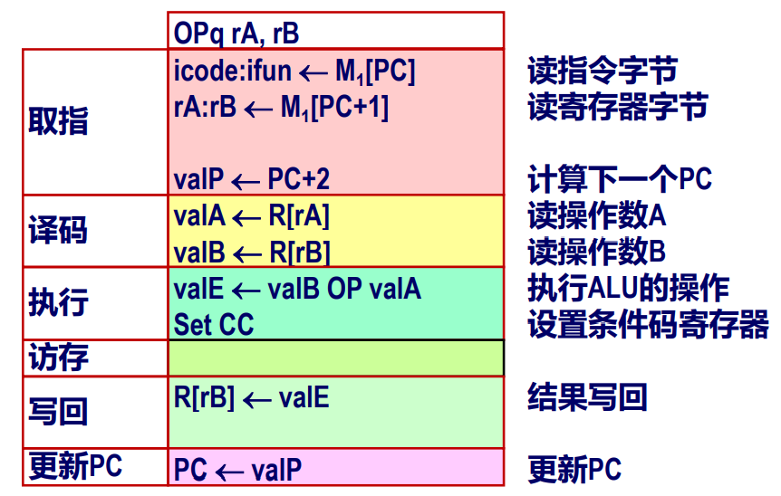
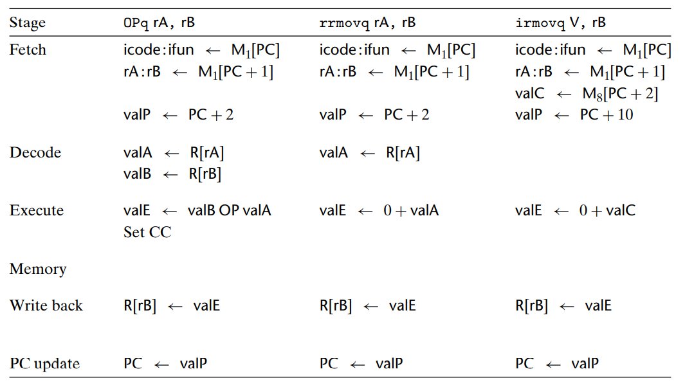
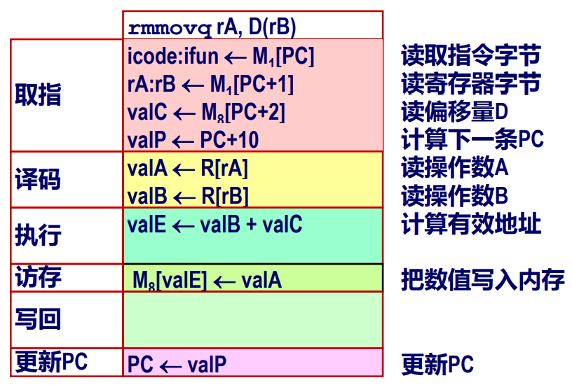
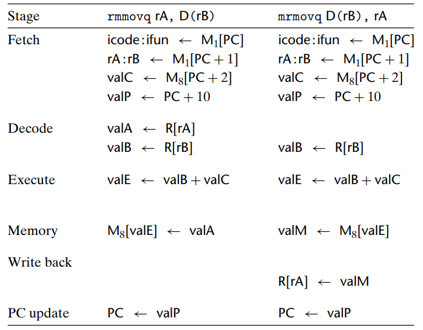
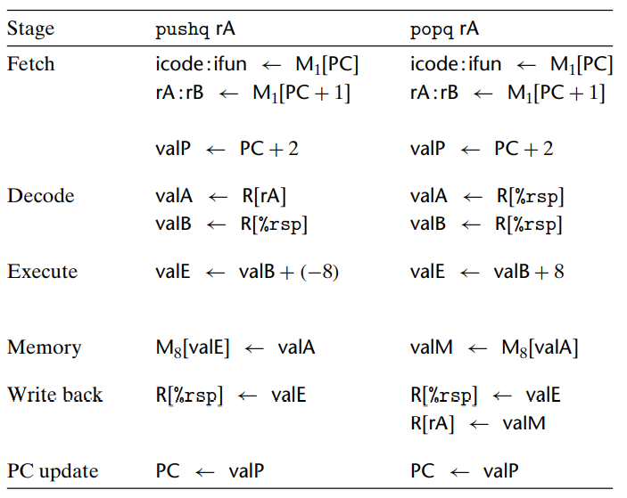
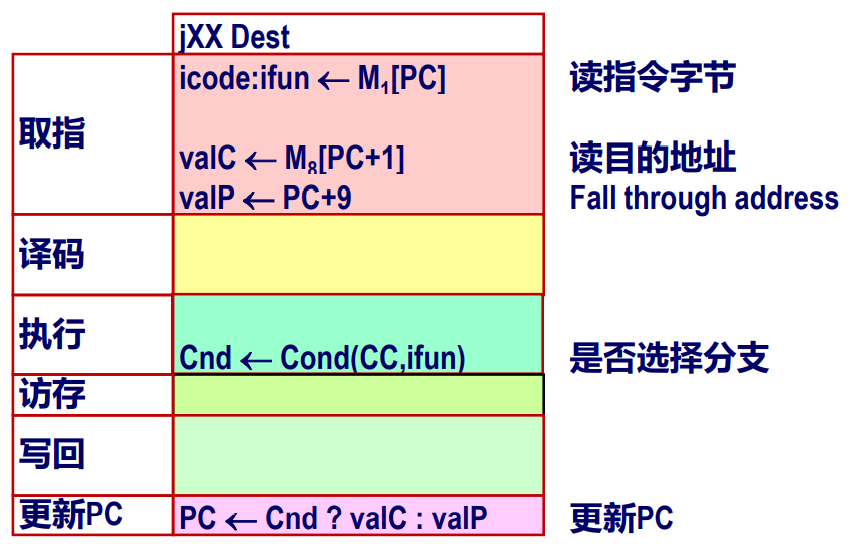
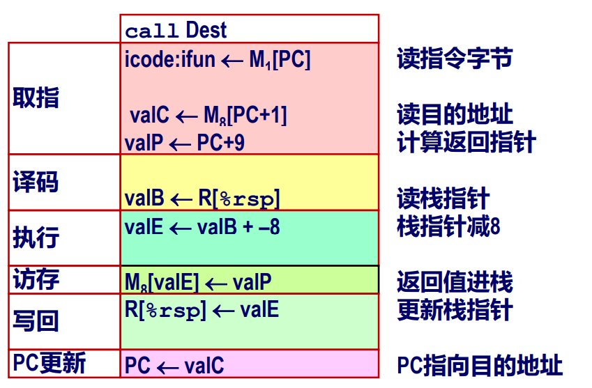
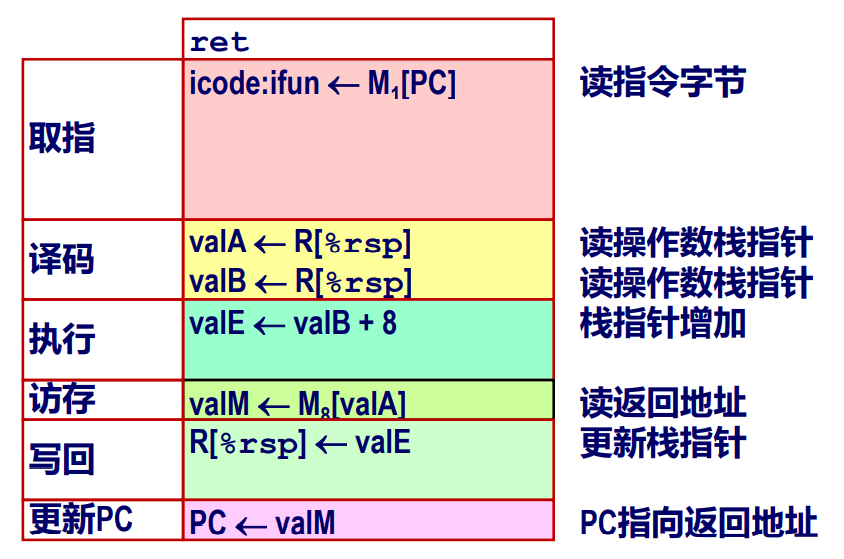
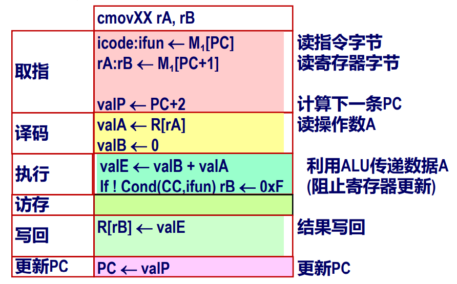
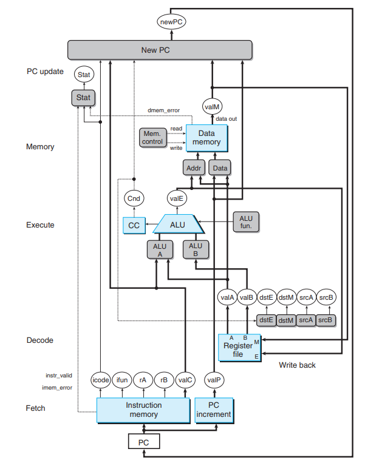

Chapter 4 处理器体系结构 III：Y86-64 的顺序实现

# 4.3 Y86-64 的顺序实现

[[toc]]

## 4.3.1 将处理组织成阶段

<a-timeline>
  <a-timeline-item><strong>取指（fetch）</strong>：从内存中读取地址为 PC 的指令字节。valP = PC + 指令长度。</a-timeline-item>
  <a-timeline-item><strong>译码（decode）</strong>：从寄存器文件读入最多两个操作数，得到 valA、valB。通常是读入指令 rA 和 rB 字段指明的寄存器，不过也有些指令是读 %rsp 的。</a-timeline-item>
  <a-timeline-item><strong>执行（execute）</strong>：ALU 要么执行指令指明的操作（根据 ifun），计算内存引用的有效地址，要么增加或减小栈指针。得到的值称为 valE。在此也有可能设置条件码，这个阶段会决定是否应该选择分支。</a-timeline-item>
  <a-timeline-item><strong>访存（memory）</strong>：读写内存，读出的值为 valM。</a-timeline-item>
  <a-timeline-item><strong>写回（write back）</strong>：最多可以写两个结果到寄存器文件。</a-timeline-item>
  <a-timeline-item><strong>更新 PC（PC update）</strong>：将 PC 设置为下一条指令的地址。</a-timeline-item>
</a-timeline>

### 计算中各数值的含义

**取指：**

| 名称        | 含义           |
| ------------- |:-------------:|
| icode  | 指令码 |
| ifun  | 指令功能  |
| rA、rB | 指令寄存器 A、B      |
| valC  |  指令中的常数  |

**译码：**

| 名称        | 含义           |
| ------------- |:-------------:|
| srcA、srcB  | 寄存器 ID A、B |
| dstE、dstM  | 目的寄存器 E、M  |
| valA、valB | 寄存器值 A、B      |

**执行：**

| 名称        | 含义           |
| ------------- |:-------------:|
| valE  | ALU 运算结果 |
| cnd  | 分支或转移标识  |

### Arith/Log. Opq

### rrmovq 和 irmovq

### rmmovq

### mrmovq

+ 注意 `mrmovq D(rB), rA` 指令的写法中 rA、rB 所在的先后顺序与指令编码中是相反的。

### pushq、popq

+ `pushq` 应该先将栈指针减去 8，即使栈指针的更新实际上是在内存操作完成后才进行的。
+ `pop` 应该首先读内存，然后再增加栈指针。

### jumps

+ 跳转的实现：在执行阶段，检查条件码和跳转条件来确定是否要选择分支，产生一个一位信号 Cnd。在更新 PC 阶段，检查这个标志，如果这个标志为 1，就将 PC 设为 valC（跳转目标），如果为 0，就设为 valP（下一条指令的地址）。

### call

+ 对指令 call，我们要将 valP，也就是 call 指令后紧跟着的那条指令的地址，压入栈中。在更新 PC 阶段，将 PC 设为 valC，也就是调用的目的地。

### ret

+ 对指令 ret，在更新 PC 阶段，我们将 valM，即从栈中取出的值，赋值给 PC。

### Conditional Move

## 4.3.2 SEQ 的硬件结构

::: details 图片说明
+ 浅蓝色方框：硬件单元，如内存、ALU 等
+ 灰色方框：控制逻辑，用 HCL 描述
+ 白色椭圆框：信号标识
+ 粗线：宽度为字长的数据（64位）
+ 细线：宽度为字节或更窄的数据（4-8位）
+ 虚线：单个位的数据
:::

