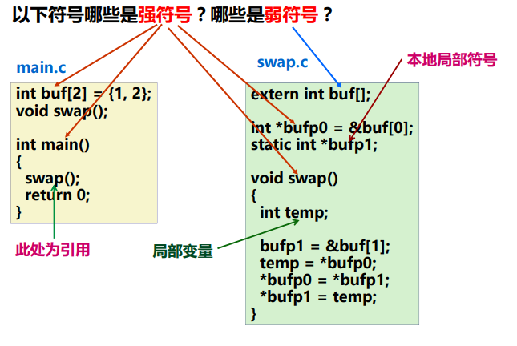
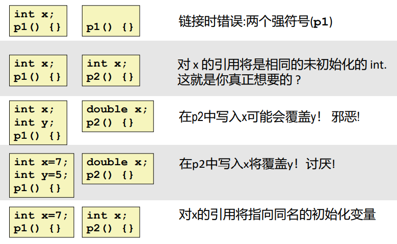
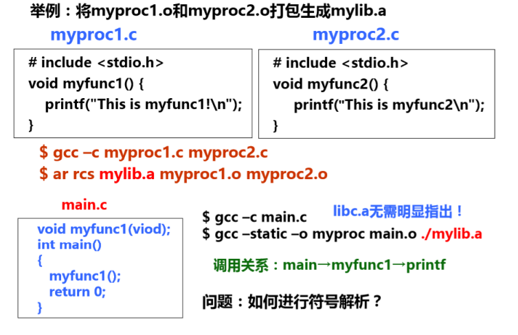

三、符号解析与重定位

[[toc]]

回顾：链接操作的步骤：
Step 1. **符号解析**（Symbol resolution）
+ 程序中有定义和引用的符号（包括变量和函数等）；
+ 编译器将定义的符号存放在一个符号表中；
  + 符号表是一个结构数组
  + 每个表项包含符号名、长度和位置等信息
+ 链接器将每个符号的引用都与一个确定的符号定义建立关联；

Step 2. **重定位**
+ 将多个代码段与数据段分别合并为一个单独的代码段和数据段；
+ 计算每个定义的符号在虚拟地址空间中的绝对地址；
+ 将可执行文件中的符号引用处的地址修改为重定位后的地址信息；

# 步骤一：符号解析

## （一）符号表和符号解析

### 3.1.1 符号和符号表

每个可重定位目标模块都有一个符号表，表中包含了在程序模块中被定义的所有符号的相关信息。

对于某个 C 程序模块 m 来说，符号有以下三种类型：
1. **全局符号**：由模块m定义并能被其他模块引用的符号。包括非 static 的C函数和非 static 的C全局变量（指不带static的全局变量）。
2. **外部符号**：由其他模块定义并被模块m引用的全局符号。包括在其他模块定义的外部函数名和外部变量名。
3. **局部符号**：仅由模块m定义和引用的本地符号。包括带 static 的函数名和全局变量名。这类在一个函数内部定义的带 static 属性的本地变量不在栈中管理，而是被分配在静态数据区，即在节 .data 或 .bss 中分配空间。

::: warning 本地非静态C变量 VS 本地静态C变量
本地符号（局部符号）不包括局部变量。局部变量时运行时动态分配在栈或寄存器中，因此他们不是符号，不会记录在符号表中。
+ 本地非静态C变量：存储在栈上
+ 本地的静态C变量：存储在 .data 或 .bss
:::

::: details 不同类型的符号举例

:::

### 3.1.2 符号

符号解析**目的**：将每个模块中引用的符号与某个目标模块中的定义符号建立关联。

每个定义符号在代码段或数据段中都被分配了存储空间，因此，将引用符号与对应的定义符号建立关联后，就可以在重定位时将引用符号的地址重定位为相关联的定义符号的地址。

> ”**符号的定义**“ 其实质就是指被分配了存储空间。函数名指其代码所在区，变量名指其所占的静态数据区。所有定义符号的值就是其所在的首地址。

+ <u>本地符号</u>在本模块内定义并引用，因此，其解析较简单，只要与本模块内唯一的定义符号关联即可。
+ <u>全局符号</u>（外部定义的、内部定义的）的解析涉及多个模块，故较复杂.

#### **全局符号的强、弱特性**

编译器在编译时，会把每个全局符号输出到汇编代码文件中，每个全局符号要么是强符号，要么是弱符号。并将这些信息存到符号表中供链接器的符号解析使用。

+ **强符号**：函数名和已初始化的全局变量名
+ **弱符号**：未初始化的全局变量名

::: details 强弱符号举例

:::

::: tip
本地符号没有强弱之分。
:::

#### **链接器的符号处理规则**：
+ 规则1：强符号只能定义一次；
+ 规则2：如果有一个强符号和多个弱符号同名，那么选择强符号；
  + 对弱符号的引用被解析为强符号
+ 规则3：如果有多个弱符号同名，那么从这些弱符号中任意选择一个。
  + 可以用 `gcc –fno-common` 命令，告诉连接器在遇到多个弱定义的全局符号时输出警告信息

::: details 链接器谜题
如果在两个不同模块定义相同的变量名，那么很可能会发生程序员意想不到的结果。特别是当两个重复定义的变量具有不同类型时，更容易出现难以理解的结果。

:::

#### **解决定义全局符号的问题的方法：**
1. 尽量避免使用全局变量；
2. 如果一定要用的话：
   + 把全局变量定义为 static，这样就没有强弱之分，如果其他函数需要引用它，就封装成一个函数。
   + 尽量给全局变量赋初值使其成为强符号，而外部变量尽量使用 extern。

### 3.1.3 与静态库的链接

所有的编译系统都提供一种机制，将所有相关目标模块打包成一个单独的文件，称为**静态库**，它可以用作链接器的输入。当链接时，它只复制静态库中被应用程序引用的目标模块。

> **背景**：如果为每个函数如 printf、scanf 等都创建一个独立的可重定文件，程序员就要显式地一次链接，这容易出错又耗时，于是静态库的概念被提出：相关的函数可以被编译成独立的目标模块，然后封装成一个单独的静态库文件，在连接时，链接器只复制被程序引用的目标模块。

+ C 编译器总是默认传送 libc.a 给链接器，因此在gcc命令行中无需明显指定。

在 Linux 系统中，静态库以一种称为**存档**（archive）的特殊文件存放在磁盘中。存档文件是一组连接起来的可重定位目标文件的集合，由 .a 后缀标识。

**创建静态库**：

::: details 自定义一个静态库文件

:::

#### **关于静态库的链接顺序问题**：
+ 通常的准则是将静态库文件放在命令行中的文件列表的后面。
+ 若相互之间有引用关系，则必须按照引用关系在命令行中排列静态文件，使得对于每个静态库目标模块中的外部引用符号，在命令行中至少有一个包含其定义的静态库文件排在后面。
+ 如果两个静态库的目标模块有相互引用关系，则在命令行中可以重复静态库文件名。

### 3.1.4 链接器符号解析的过程

在符号解析阶段，链接器从左到右按照他们在编译器驱动程序命令行上出现的顺序来扫描可重定位目标文件和存档文件，

链接器维护三个集合：
+ **E**：<u>可重定位目标文件的集合</u>。这个集合中的文件会被合并起来形成可执行文件。
+ **U**：<u>一个未解析的符号的集合</u>。即引用了但是尚未看到定义的。
+ **D**：<u>一个在前面输入文件中已定义的符号集合</u>。

过程：
+ 初始时，E、U、D 均为空。
+ 对命令行中每个输入文件f：
  + 若 f 是目标文件：把 f 添加到 E，修改 U 和 D 来反映 f 中的符号定义和引用，并继续下一个输入文件；
  + 若 f 是存档文件：尝试匹配 U 中所有未解析符号和由 f 定义的符号。如果检测到 f 中的成员 m 定义了一个 U 中的符号，就把 m 加到 E 中，并修改 U 和 D 来反映 m 中的符号定义和引用。对存档文件中所有成员目标文件都依次进行这个过程，直到 U 和 D 不再发生变化，就继续下一个输入文件。
+ 如果所有输入文件全部扫描完后，U 是非空的，name链接器就会输出一个错误并终止，否则，它会合并和重定位 E 中的目标文件，构建输出的可执行文件。

> 具体示例可见教材

# 步骤二：重定位

